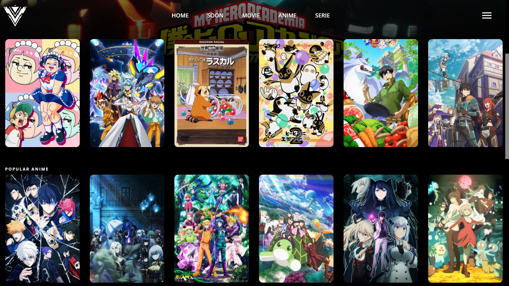
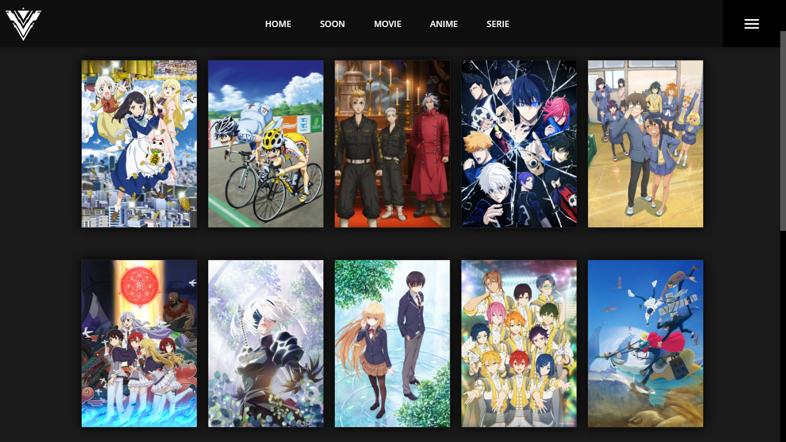
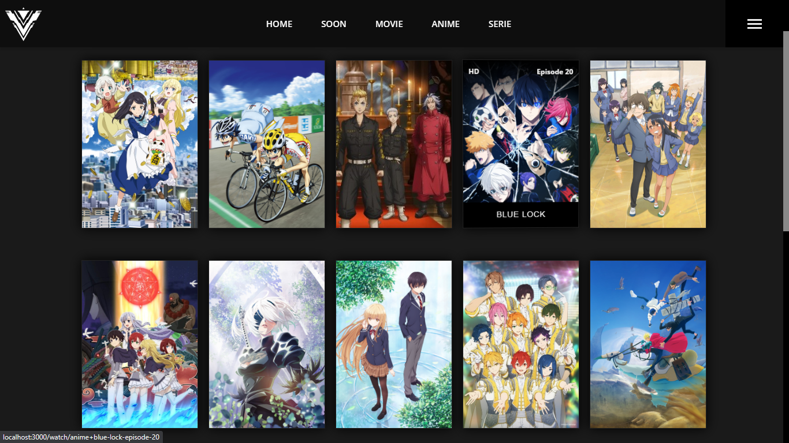
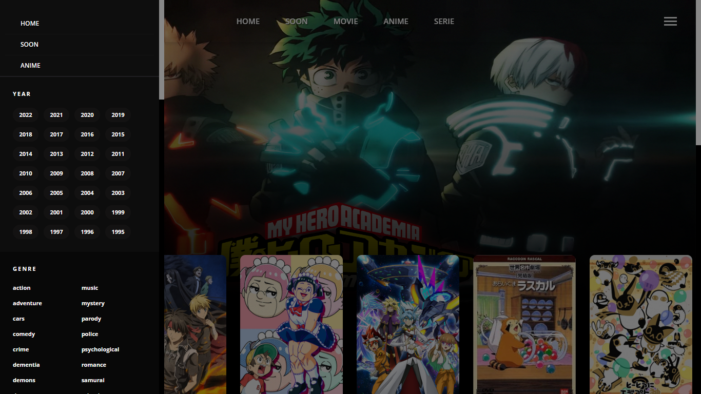
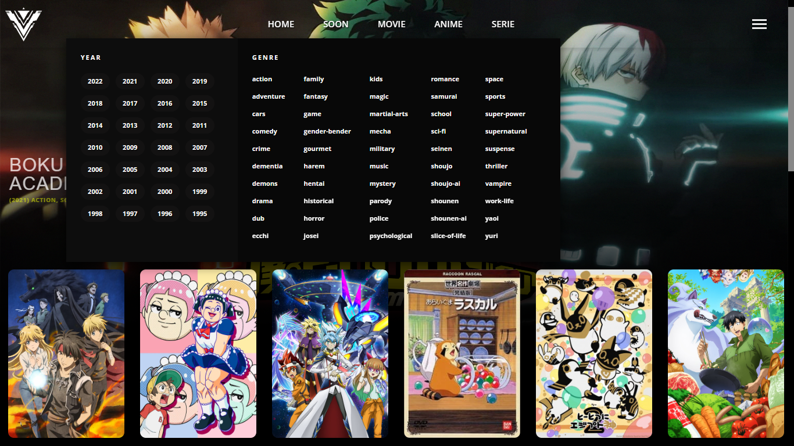
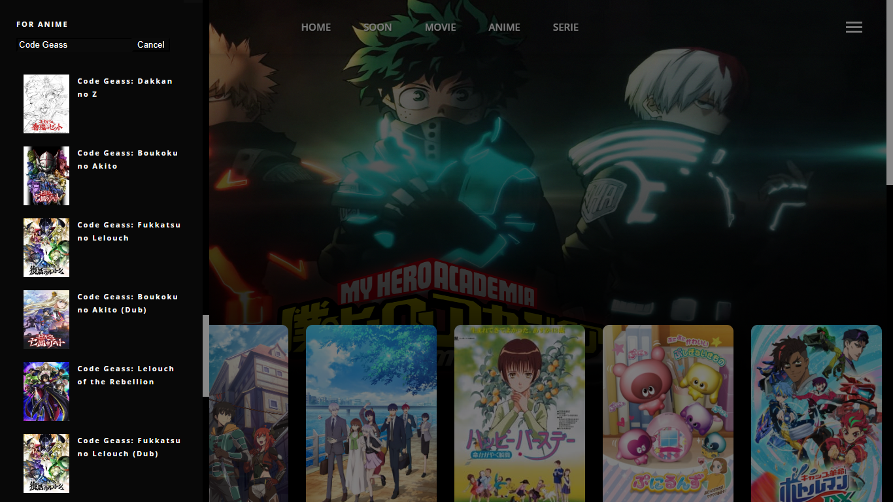
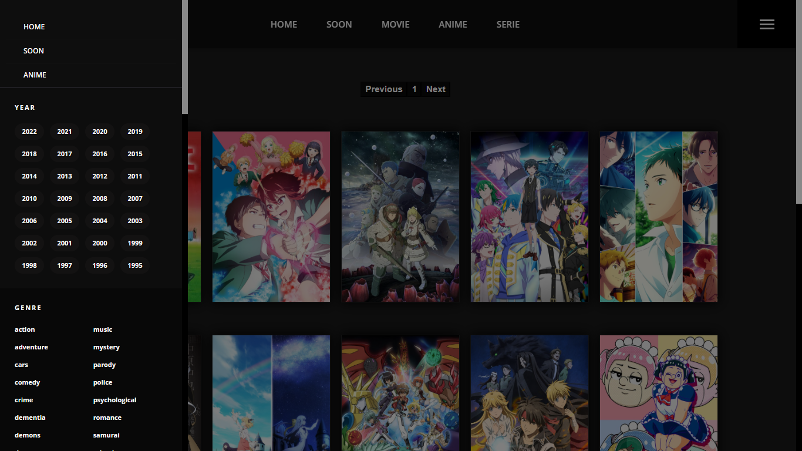
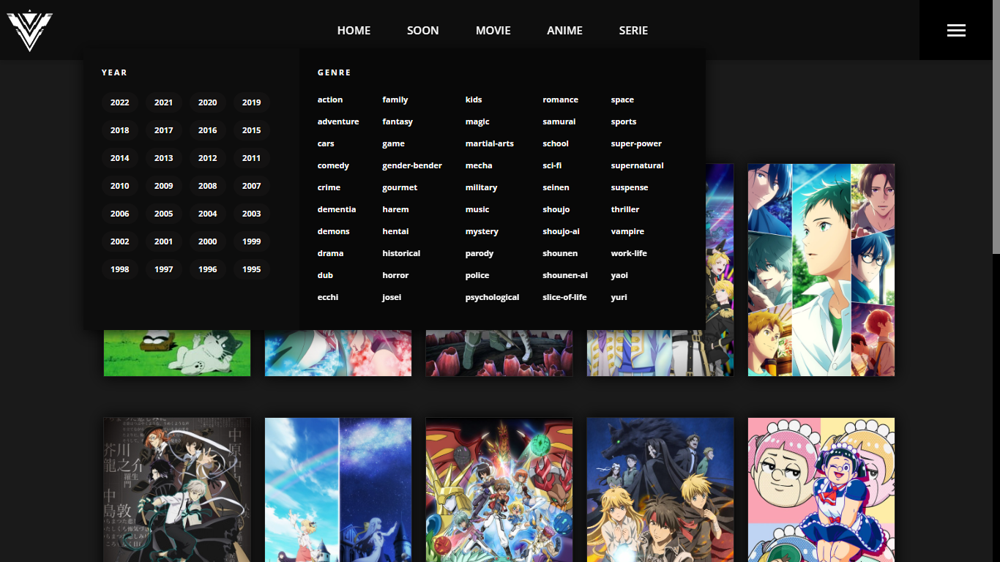

# Anime
Dynamic anime sigle page website.

## Technologies
This website was made with the following technologies:
- HTML5
- CSS3
- JavaScript

## Sections
This webpage contains 3 main sections: **Home**, **NavBar** and **Anime**. In addition to having other sections such as **Watch Episode**, **Anime Information** and **Coming Soon**.

### Home
#### In this section you will see the recent episodes that have been uploaded, the anime of the day and anime of the week, and news related to anime.

### Anime
#### In this section you can see the anime that are on this website.

### NavBar
#### In this section has a pagination and you can also filter them by genre, type, year, status and order.

### Watch Episode
#### This section will show the episode, as well as the chapters following or preceding it, and the information of the anime, such as its synopsis, what genre it has, number of episodes, duration of each episode, release date, if it is finished or in broadcast, its sequels or prequels and alternative titles, it also has the option to see the trailer of the anime and finally the anime similar to this.

### Coming Soon
#### In this section is the news to read from the anime. It also has a mini section to see more news.

